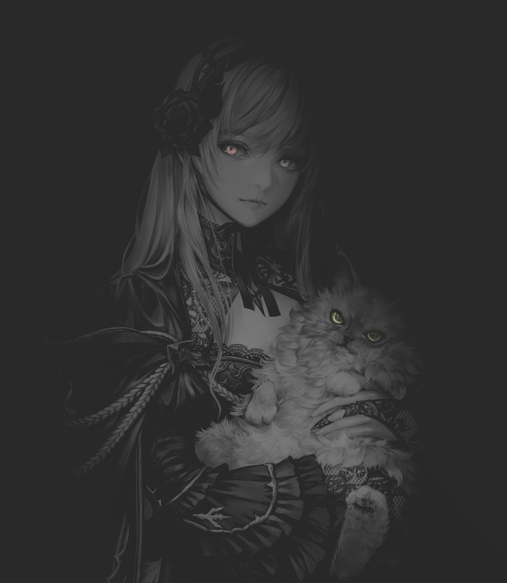

<div align="center">
    <p>
        
    </p>
</div>

```zsh
joey@huang: ~/readme $ fastfetch
```



```csharp
------------------------------------------------------------
username: ArtRoll
whoami: ??
pronouns: he/him
os: arch, ubuntu, Windows
languages: python, c#
learning: ceh
reading: nothing atm
locations: iran
hobbies: programming, gaming, anime/manga, music, fashion
song: Cinnamon Girl
favorite.game: pubg
favorite.anime: one piece
------------------------------------------------------------
```

<h3 align="center"> Languages & Tools</h2>

<p align="center">
  <a href="">
    
  </a>
</p>


<div align="center">
<h3 align="center">Connect with me</h3>

[](https://artroll.com)
[](https://www.linkedin.com/in/artroll/)
[](https://github.com/artroll)
[](mailto:artroll.dev@gmail.com)
</div>

<div align="center">
    


</div>

<h3 align="center">Thanks for Reading <3</h3>
